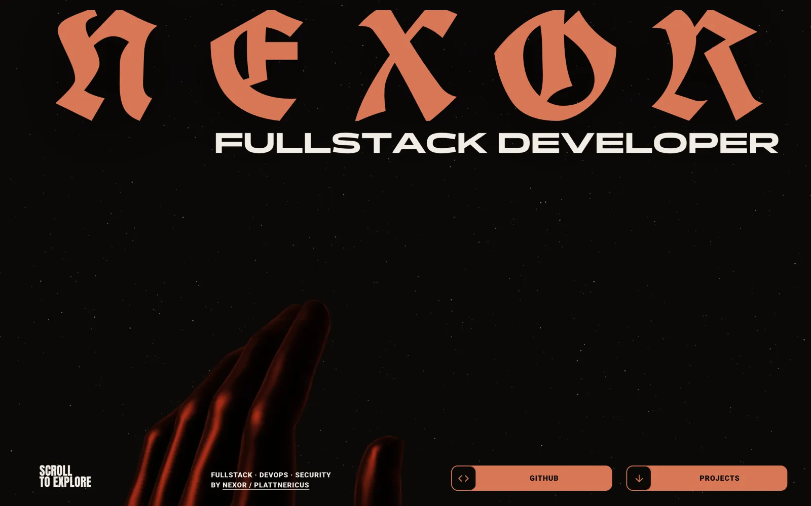
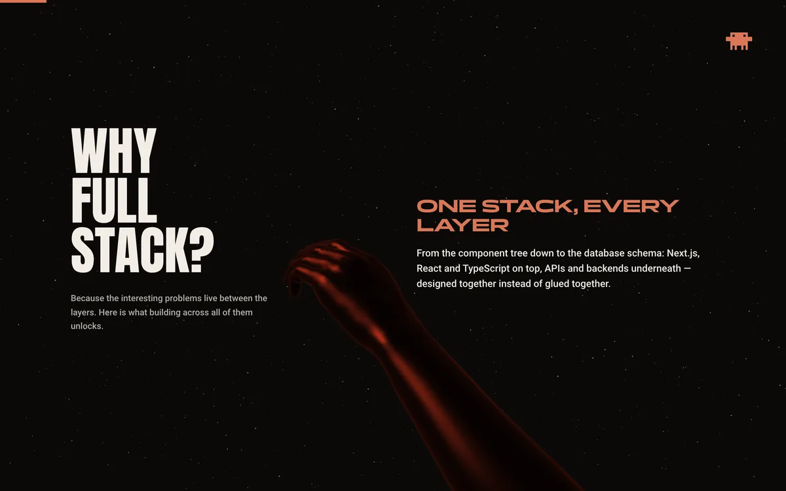
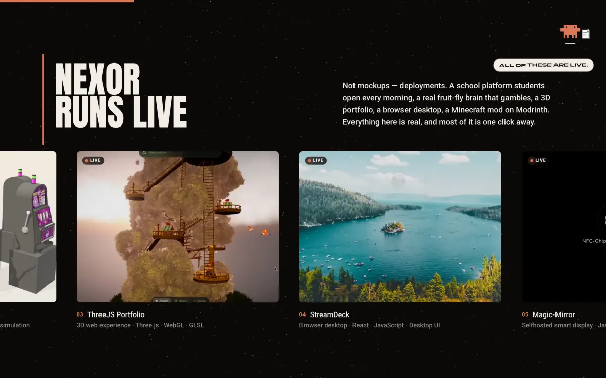
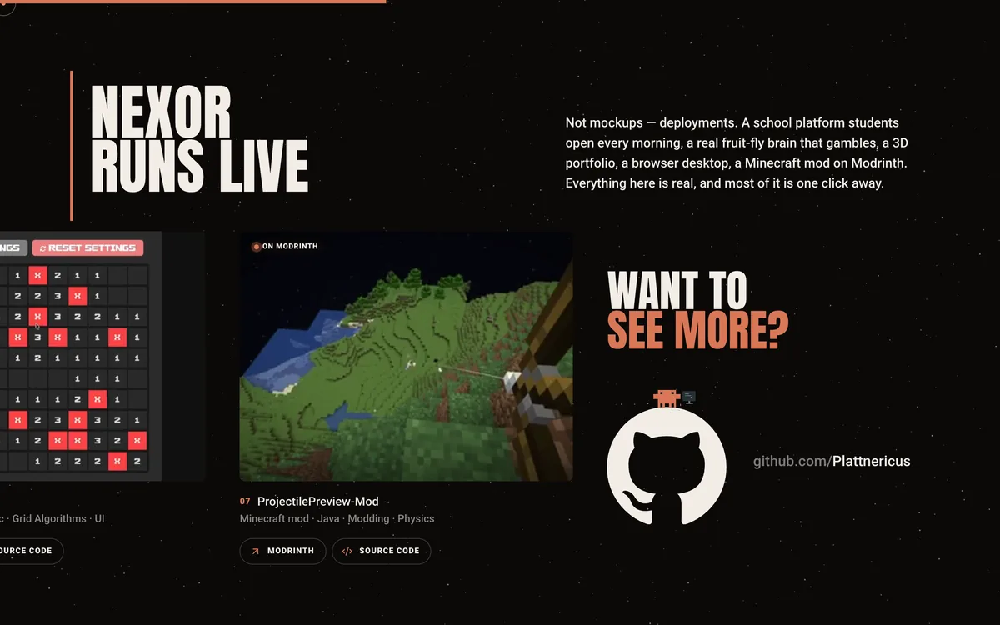
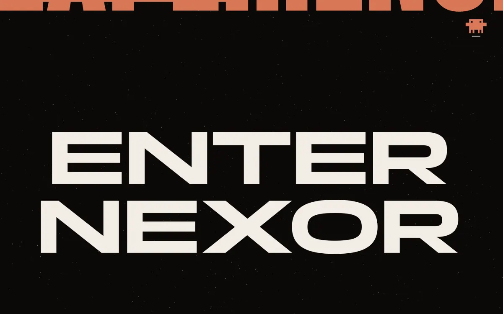
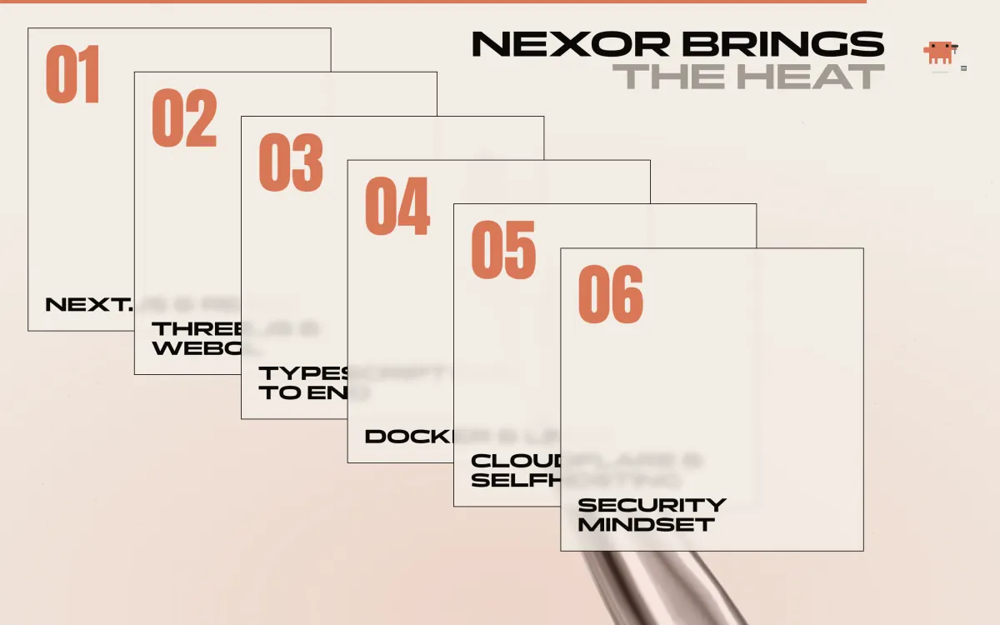
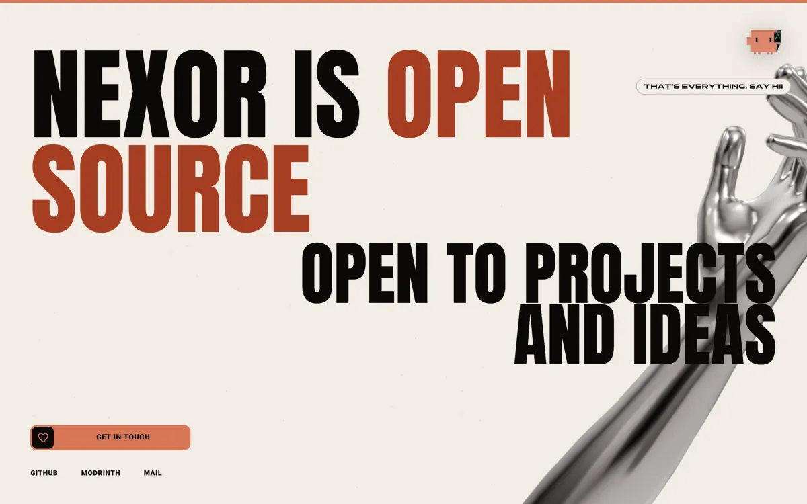
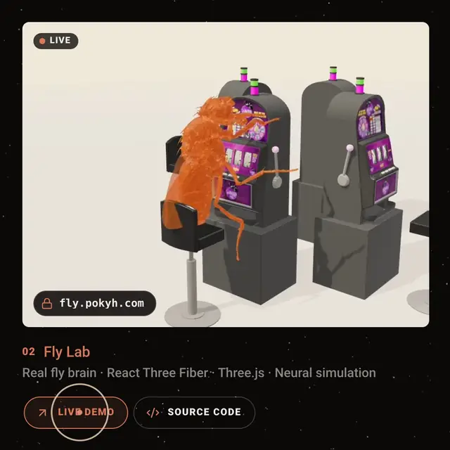
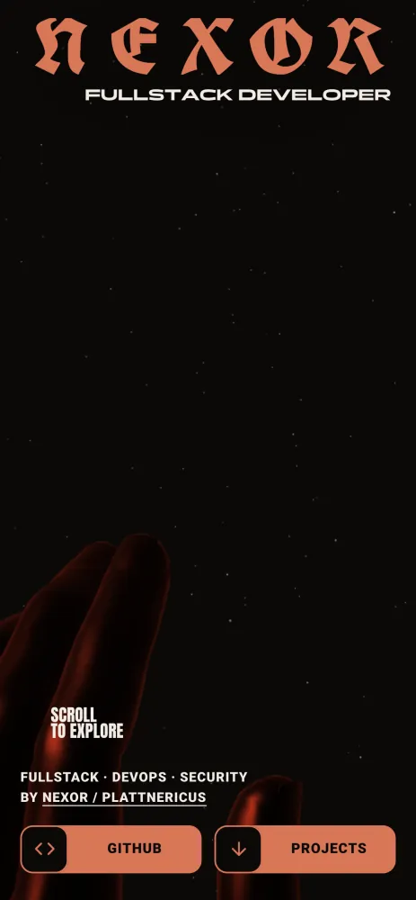

<div align="center">

<a href="https://plattnericus.dev">
  
</a>

<h1>plattnericus.dev</h1>

<p><strong>The personal site of Nexor / Plattnericus</strong><br />
Fullstack development, DevOps and security — real software, deployed and running.</p>

<p>
  <a href="https://plattnericus.dev"></a>
</p>

<p>
  
  
  
  
  
  
</p>

<p>
  <a href="#the-site">The site</a> ·
  <a href="#projects">Projects</a> ·
  <a href="#under-the-hood">Under the hood</a> ·
  <a href="#getting-started">Getting started</a> ·
  <a href="#project-structure">Structure</a>
</p>

</div>

<br />

<table align="center">
  <tr>
    <td align="center" width="170"><h3>222 KB</h3><sub>compressed JS by<br />the load event</sub></td>
    <td align="center" width="170"><h3>0.00</h3><sub>layout shift, phone<br />to 1080p desktop</sub></td>
    <td align="center" width="170"><h3>120 fps</h3><sub>with four project clips<br />looping at once</sub></td>
    <td align="center" width="170"><h3>7</h3><sub>live projects, each with<br />demo and source</sub></td>
  </tr>
</table>

<br />

## The site

A single page you scroll through like a film. Every section is choreographed
against the same scroll position, pinned where a moment deserves to hold, and
a 3D arm travels through all of it — orange and moody in the dark first act,
polished silver once the page turns cream.

<table>
  <tr>
    <td width="50%"></td>
    <td width="50%"></td>
  </tr>
  <tr>
    <td><sub><strong>Why full stack?</strong> — the headline holds still while the beats scroll past; the one you are reading takes the floor.</sub></td>
    <td><sub><strong>Nexor runs live</strong> — a pinned row of real deployments, every clip on screen looping, each with a live demo and its source.</sub></td>
  </tr>
  <tr>
    <td></td>
    <td></td>
  </tr>
  <tr>
    <td><sub><strong>Want to see more?</strong> — the GitHub mark rolls in with the row and Clawd glides over to sit on it.</sub></td>
    <td><sub><strong>Enter Nexor</strong> — the camera dives straight into the T until it floods the frame cream.</sub></td>
  </tr>
  <tr>
    <td></td>
    <td></td>
  </tr>
  <tr>
    <td><sub><strong>Nexor brings the heat</strong> — seven skill cards deal themselves out over the silver hand.</sub></td>
    <td><sub><strong>Open to projects and ideas</strong> — the headline slides up out of its masks, the hand turns one last time.</sub></td>
  </tr>
</table>

### Live demo, or the source



Every project card has two quiet buttons. Hovering one previews where it leads,
right on the clip:

- **Live demo** types the site's address into a chip at the foot of the clip.
- **Source code** scans the footage into glyphs — the clip, redrawn as code
  punctuation in the page's terracotta and cream, sweeping in behind a
  flickering scan head — and types out the repository.

The glyphs follow the clip as it plays, line up with the footage at the scan
edge (hover zoom and scroll parallax included), and stay legible on bright and
dark scenes alike. On a phone, pressing a button shows the same preview; with a
keyboard, focusing it does.

<br clear="right" />



### Details worth noticing

- **The intro** paints the real NEXOR letterforms on the very first frame — the
  wordmark's face is a 2 KB subset inlined into the stylesheet, so nothing waits
  on a font request.
- **Clawd**, the pixel mascot, lives in the corner — 22 hand-animated clips.
  He reacts to the section you are in, downloads on the way down and uploads on
  the way up when you scroll fast, dozes off if you leave him alone, can be
  dragged anywhere, and glides onto the GitHub mark when the project row ends —
  and back home when you move on. On the 404 he hops from digit to digit, over
  to whichever one you point at.
- **Every button** rolls its label over letter by letter and swaps its icon on
  hover, and leans a little toward the pointer.
- **The browser tab** keeps up with you: the favicon draws your scroll progress
  and the title changes with each section.
- **Reduced motion** is a first-class path, not an afterthought: no canvas, no
  scroll choreography, and a short notice in the visitor's own language — one
  of fifty — explaining why the page is calm, loaded only for those visitors.
- **Phones** get their own layout for every section rather than a squeezed
  desktop one — held sideways, too.

<br clear="right" />

## Projects

Everything in the row is deployed and one click away — and so is its code.

| Project | What it is | Built with | Live | Source |
|---|---|---|---|---|
| **POKYH** | School platform: timetable, grades, absences, messages | Next.js, TypeScript, Docker, Cloudflare | [pokyh.com](https://pokyh.com) | [bedchem/POKYH](https://github.com/bedchem/POKYH) |
| **Fly Lab** | A real fruit-fly connectome — 60,001 neurons — simulated in the browser | React Three Fiber, Three.js, Vite | [fly.pokyh.com](https://fly.pokyh.com) | [bedchem/fruit-fly-hub](https://github.com/bedchem/fruit-fly-hub) |
| **ThreeJS Portfolio** | Immersive 3D portfolio with camera choreography | Three.js, WebGL, GLSL | [threejs.plattnericus.dev](https://threejs.plattnericus.dev) | [Plattnericus/Stargazer_Tree](https://github.com/Plattnericus/Stargazer_Tree) |
| **StreamDeck** | A browser desktop with app-like windows | React, JavaScript | [streamdeck.plattnericus.dev](https://streamdeck.plattnericus.dev/desktop) | [Plattnericus/StreamDeck](https://github.com/Plattnericus/StreamDeck) |
| **Magic-Mirror** | Selfhosted smart display on a Raspberry Pi | Node.js, Raspberry Pi | [magicmirror.plattnericus.dev](https://magicmirror.plattnericus.dev) | [bedchem/Magic-Mirror](https://github.com/bedchem/Magic-Mirror) |
| **Minesweeper** | The classic, rebuilt as real-time multiplayer | Grid algorithms, Socket.IO | [minesweeper.plattnericus.dev](https://minesweeper.plattnericus.dev) | [bedchem/Minesweeper](https://github.com/bedchem/Minesweeper) |
| **ProjectilePreview-Mod** | Minecraft mod that draws projectile paths in real time | Java, Fabric | [Modrinth](https://modrinth.com/mod/projectile.preview) | [Ryhox/ProjectilePreview-Mod](https://github.com/Ryhox/ProjectilePreview-Mod) |

The list lives in [`lib/projects.ts`](lib/projects.ts) and feeds the row, the
structured data, the sitemap and the crawler-readable [`/ai`](https://plattnericus.dev/ai) page.

## Under the hood

**One scroll source, two renderers.** Lenis smooths the input and drives GSAP's
ticker; every section reads the same position through ScrollTrigger, while the
React Three Fiber scene reads it on its own clock to keep the arm and the
warp-tunnel starfield in step — no state passed between the two layers.

**Pins that don't shift the page.** The pinned sections are CSS `sticky`, sized
by script before each ScrollTrigger refresh, never GSAP's `position: fixed` pin
— that is what keeps layout shift at zero, even across resizes and rotations.
The project row sizes its cards by the screen's height as well as its width, so
the heading, the clips and their buttons fit a short laptop screen with room to
breathe.

**Compositor-first motion.** Every one of Clawd's jumps — crouch, arc, lean,
squash, landing, the spot giving under him — is baked into keyframes up front,
exactly one animation per element, and played through the Web Animations API.
That is what lets the browser run all of it on the compositor at the display's
own refresh rate: 120 fps on a ProMotion screen, and still drawing while the
main thread is blocked. A jump that cuts another short picks up his speed
mid-air instead of stopping dead. Scroll-driven writes only touch `transform`
and `opacity`, and only when a value actually changes.

**Every clip plays, at full frame rate.** With two or more videos playing,
Chrome treats a page like a video call and runs the whole display at the
videos' 30 Hz — every animation on it included (measured on a 120 Hz Mac: 121
fps with one clip, 31 with three). A clip painted into a canvas doesn't count
as a video, so each `<video>` plays on unseen and every frame it decodes is
copied onto a canvas in its place, driven by `requestVideoFrameCallback`
(~0.2 ms a frame). Result: four clips looping side by side at 120 fps. A clip
the browser pauses on its own is started again.

**The source-code scan stays off the main thread.** At most once per video
frame, the visible crop of the clip is shrunk to one pixel per glyph cell with
`createImageBitmap` and handed to a Web Worker, which reads it back, works out
each cell's glyph and colour, and sets them on an `OffscreenCanvas`; the page
only draws the finished layer, cut off at the scan head. Reading a video frame
back from the GPU stalls whichever thread asks, so it's the worker's thread
that waits — the page holds 120 fps through the whole scan. Browsers without
the pieces for that fall back to doing the same work on the page.

**Nothing loads before it has to.**

| Piece | Budget |
|---|---|
| First load | 222 KB of compressed JS by the load event; the 3D bundle (Three.js + R3F) loads after it, off the critical path |
| Project clips | 3.4 MB for all seven, H.264 at 912×684, fetched only after the intro and within two screens of view; only clips on screen play |
| 3D | a single 84 KB arm model, loaded through three's own `GLTFLoader` — no decoders shipped for compression it doesn't use |
| Source-code scan | built on first hover; its worker starts then, and its canvases only hold a bitmap while the scan shows |
| Mascot | 48 KB for all 22 clips, warmed up at low priority once the page is idle, desktop only |
| Caching | clips, model, posters and fonts cached for a week with stale-while-revalidate |

**Built for machines as well as people.** JSON-LD for the person, site and every
project — each with its code repository — a sitemap with image entries,
`robots.ts`, and `llms.txt` / `llms-full.txt` / `ai.txt` summaries for
answer-engine crawlers.

## Getting started

```bash
npm install
npm run dev        # http://localhost:3000
```

| Script | Does |
|---|---|
| `npm run dev` | Start the dev server (Turbopack) |
| `npm run typecheck` | `tsc --noEmit` |
| `npm run lint` | `eslint .` |
| `npm run build` | Production build |
| `npm run check` | typecheck → lint → build, in that order |

No environment variables are required. The optional ones are listed in
[`.env.example`](.env.example):

| Variable | Purpose |
|---|---|
| `GOOGLE_SITE_VERIFICATION` | Google Search Console verification meta tag |
| `NEXT_PUBLIC_SITE_URL` | Canonical URL for metadata, sitemap and JSON-LD (handy on preview deployments); defaults to `https://plattnericus.dev` |

## Project structure

<details>
<summary><strong>Show the tree</strong></summary>

```
app/
  page.tsx               section order, JSON-LD graph
  layout.tsx              fonts, global metadata
  globals.css              design tokens and every section's styles
  not-found.tsx             404: starfield, orange arm, Clawd hopping across the digits
  ai/                        crawler-readable profile page
  robots.ts, sitemap.ts       search surface
  *-image.jpg, icon.tsx        link-preview image (a frame of the real hero) and icons

components/
  lenis-style/   the sections — Hero, Why, Showcase, Rethink, Solution, Heat, Footer —
                 and the project card: its clip (painted onto a canvas), the two
                 buttons, and the source-code scan with its worker
  gl/            the scroll-synced R3F scene, the 404 scene, the shared arm, WebGL guards
  clawd/         the mascot, his jump engine, the GitHub-mark flights, the 404 hops
  loader/        the NEXOR intro
  motion/        custom cursor, living favicon, reduced-motion notice
  providers/     Lenis + ScrollTrigger wiring
  ui/            the pill and rolling-label building blocks
  brand/         the wordmark

lib/
  projects.ts    the project row: live sites, repositories, clips
  site.ts        identity and metadata config
  animation.ts   GSAP setup, eases, breakpoints
  clawd.ts       mascot clips and lines
  palette.ts     colour tokens for canvas and image code
```

</details>

## Media

- **Project clips** (`public/projects/`) are 912×684, H.264 (`-preset veryslow`,
  CRF 26–30 with adaptive quantisation), muted, `+faststart`. The cards are always
  4:3 with `object-fit: cover`, so anything outside a centred 4:3 crop is never
  seen. Clips whose last seconds differ from their first get a short crossfade
  from tail to head so they loop without a jump.
- **Posters** (`public/showcase/`) are listed in the sitemap for image search —
  1200px WebP — and stand in for a clip in the source-code scan until its first
  frame has decoded.
- **Clawd's clips** (`public/models/mascot/webp/`) are pixel art on a 96px grid,
  stored at exactly 2x as lossless animated WebP — frame for frame identical to
  the source GIFs at a fraction of their size — and drawn with
  `image-rendering: pixelated`. His feet are 68.2% down the sprite and his body
  sits 40.6% across it, leaving the right of the frame to his props; everything
  he lands on is lined up with those two (`FEET` and `BODY_X` in
  `components/clawd/motion.ts`). Bump `ASSET_VERSION` in `lib/clawd.ts` whenever
  they are regenerated.
- **The link preview** (`app/opengraph-image.jpg`, `app/twitter-image.jpg`) is
  a frame of the real hero, rendered by the site itself at 2x — wordmark,
  starfield, the orange hand — with the page chrome hidden and only the domain
  added, then downscaled to 1200×630 and saved as an ~90 KB JPEG, small enough
  for every messenger's preview.
- **The NEXOR face** is an inlined subset of UnifrakturCook (only N E X O R, the
  digits and the space). A new letter in the wordmark means regenerating it from
  `public/fonts/UnifrakturCook/` — see the comment in `globals.css`.

## Credits

Type: **Panchang** by Indian Type Foundry via Fontshare
([licence](public/fonts/Panchang-LICENSE.txt)), **UnifrakturCook** by j. 'mach'
wust and Peter Wiegel ([OFL](public/fonts/UnifrakturCook/OFL.txt)), **Anton** and
**Roboto** from Google Fonts. The GitHub mark belongs to GitHub.

## Deployment

Deployed on [Vercel](https://vercel.com), straight from `main`.

<br />

<div align="center">
  <sub>Built by <a href="https://github.com/Plattnericus">Nexor / Plattnericus</a> · <a href="https://plattnericus.dev">plattnericus.dev</a></sub>
</div>
